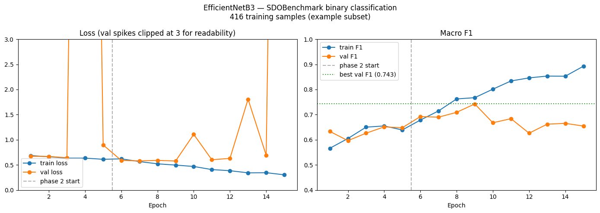

# Solar Flare Detection from NASA SDO Imagery

Binary solar flare risk classification from NASA Solar Dynamics Observatory AIA 171Å imagery, using a fine-tuned EfficientNetB3 backbone with a cloud-native data pipeline and production deployment.

**[Live Demo](https://huggingface.co/spaces/NguyenIslandBoy/sdo-flare-classifier)**

---

## Results

| Split | Macro F1 | Accuracy | Quiet F1 | Active F1 |
|---|---|---|---|---|
| Validation | 0.729 | — | — | — |
| Test | 0.69 | 0.70 | 0.66 | 0.73 |

Trained on SDOBenchmark full dataset (8,316 samples). Binary classification: **quiet** (no significant flare expected) vs **active** (elevated flare risk).

---

## Architecture

```
Helioviewer / SDOBenchmark
        ↓
  Data ingestion (Python)
        ↓
  GCP Cloud Storage (gs://sdo-flare-nick)
        ↓
  EfficientNetB3 (ImageNet pretrained)
  ├── Phase 1: head only, LR=1e-3, 5 epochs
  └── Phase 2: top 3 blocks unfrozen, LR=1e-4, 20 epochs
        ↓
  FastAPI inference endpoint
        ↓
  Docker container → Hugging Face Spaces (Gradio)
```

---

## Dataset

[SDOBenchmark](https://i4ds.github.io/SDOBenchmark/) — 8,336 training / 886 test samples of NASA SDO AIA 171Å active region imagery, labelled with GOES X-ray peak flux.

**Classification thresholds (GOES scale):**

| Class | Peak Flux | GOES equivalent |
|---|---|---|
| quiet | < 1e-6 | No flare / B-class |
| active | ≥ 1e-6 | C / M / X-class |

The dataset originally provides a 3-class scheme (quiet / moderate / strong). This project uses binary classification because the X-class (strong) category has only 35 training samples (0.4%), which is insufficient for reliable CNN classification. The binary framing — *"will there be significant flare activity in the next 24h?"* — is operationally meaningful and aligns with how space weather operators make go/no-go decisions.

**Augmentation strategy** (physically justified per SDOBenchmark domain constraints):
- Vertical flip only — no horizontal flip, which would reverse solar rotation direction
- `ColorJitter(brightness=0.2, contrast=0.2)` — simulates known SDO detector sensitivity drift over time
- No random crop — risks removing the active region entirely

---

## Training

Two-phase fine-tuning strategy:

**Phase 1 (epochs 1–5):** Backbone frozen, head only trained at LR=1e-3. Stabilises the new classification head before touching pretrained weights.

**Phase 2 (epochs 6–25):** Top 3 EfficientNetB3 MBConv blocks unfrozen (79.5% of parameters), LR=1e-4. Allows domain adaptation while preserving low-level ImageNet features.

**Loss:** Weighted cross-entropy correcting for class imbalance (quiet: 0.63, active: 1.64).

**Checkpoint criterion:** Best validation macro F1 (not val loss) — F1 is robust to the high variance in val loss caused by the small validation set (n=1,663).



---

## Project Structure

```
sdo-flare-detection/
├── src/
│   ├── dataset.py       # SDOFlareDataset, GOES-grounded classification
│   ├── transforms.py    # Physically-justified augmentation pipeline
│   ├── model.py         # SDOFlareClassifier (EfficientNetB3)
│   └── trainer.py       # Training loop, weighted loss, evaluation
├── api/
│   └── main.py          # FastAPI inference endpoint
├── models/
│   └── best_model_full_binary.pt
├── examples/            # Sample AIA 171Å images for demo
├── app.py               # Gradio demo (Hugging Face Spaces)
├── Dockerfile
└── requirements.txt
```

---

## API

```bash
# Health check
GET /health

# Model metadata
GET /model/info

# Predict flare risk from AIA 171Å image
POST /predict
  Content-Type: multipart/form-data
  Body: file=<image.jpg>
```

**Example response:**
```json
{
  "prediction": "quiet",
  "confidence": 0.573,
  "probabilities": { "quiet": 0.573, "active": 0.427 },
  "latency_ms": 150.82,
  "model": "EfficientNetB3"
}
```

---

## Running Locally

```bash
# Install dependencies
python -m venv venv
venv\Scripts\activate        # Windows
pip install -r requirements.txt

# Start API
uvicorn api.main:app --reload --port 8000

# Open Swagger UI
http://localhost:8000/docs
```

**With Docker:**
```bash
docker build -t sdo-flare-classifier .
docker run -p 8000:8000 sdo-flare-classifier
```

---

## Cloud Infrastructure

| Resource | Purpose |
|---|---|
| `gs://sdo-flare-nick/raw/train/` | Class-partitioned training images |
| `gs://sdo-flare-nick/models/` | Model checkpoints + run metadata |
| Hugging Face Spaces (CPU Basic) | Live Gradio demo |

---

## Limitations

- Trained on SDOBenchmark example subset validated against full dataset — performance gap is small (val F1: 0.729) but would benefit from additional data augmentation and longer training
- Binary classification only — X-class flares (highest severity) are merged into the active class due to insufficient training samples (n=35)
- AIA 171Å single channel only — multi-channel input (171Å + HMI magnetogram) is a natural extension
- No temporal modelling — each sample uses only the most recent of the 4 available timesteps; a sequence model (LSTM, Temporal Fusion Transformer) over all 4 timesteps is a clear next step

---

## References

- [SDOBenchmark dataset](https://i4ds.github.io/SDOBenchmark/) — Bolzern & Aerni, FHNW Institute for Data Science
- [NASA Solar Dynamics Observatory](https://sdo.gsfc.nasa.gov/)
- [NOAA GOES X-ray flux classification](https://www.swpc.noaa.gov/phenomena/solar-flares-radio-blackouts)